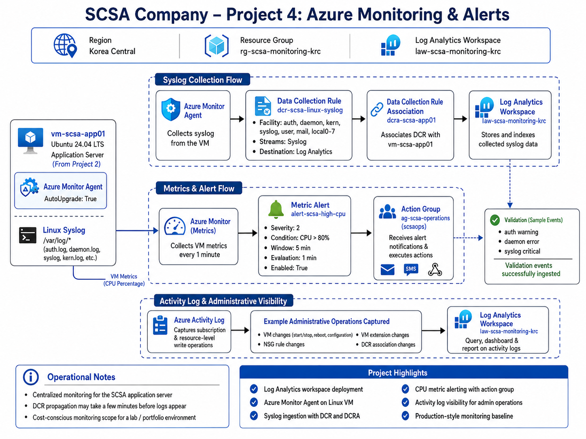

# SCSA Company – Project 4: Azure Monitoring and Alerts

## Project Overview

This project demonstrates the implementation of centralized monitoring, logging, alerting, and administrative visibility for SCSA Company’s Azure environment.

The solution extends the Linux application server deployed in Project 2 by adding Azure Monitor Agent, Data Collection Rules, Log Analytics, metric alerts, action groups, and Azure Activity Log visibility.

## Business Scenario

SCSA Company requires operational visibility into its Azure workloads so the IT team can:

- Monitor VM health and performance
- Collect Linux system logs centrally
- Detect high resource usage
- Review administrative changes
- Support troubleshooting and incident response
- Maintain a cost-conscious monitoring baseline

## Architecture Diagram



## Azure Region

- Korea Central

## Monitoring Resource Group

- `rg-scsa-monitoring-krc`

## Log Analytics Workspace

- Name: `law-scsa-monitoring-krc`
- Region: Korea Central
- SKU: `PerGB2018`

The workspace acts as the centralized destination for Linux Syslog data collected from the application server.

## Monitored Workload

Project 4 monitors the Linux application server created in Project 2:

- VM: `vm-scsa-app01`
- Operating System: Ubuntu Server 24.04 LTS
- VM Size: `Standard_B2als_v2`

This demonstrates how monitoring can be layered onto an existing Azure workload rather than deployed as an isolated lab.

## Azure Monitor Agent

The Azure Monitor Agent was installed on `vm-scsa-app01`.

### Configuration

- Extension: `AzureMonitorLinuxAgent`
- Publisher: `Microsoft.Azure.Monitor`
- Automatic upgrade: Enabled

The agent collects telemetry according to Data Collection Rules assigned to the VM.

## Data Collection Rule

### DCR

`dcr-scsa-linux-syslog`

The DCR sends selected Linux Syslog events to the Log Analytics Workspace.

### Collected Facilities

- `auth`
- `authpriv`
- `daemon`
- `syslog`

### Collected Severities

- Warning
- Error
- Critical
- Alert
- Emergency

Only operationally useful log levels were selected to reduce unnecessary data ingestion.

## DCR Association

The DCR is associated with:

`vm-scsa-app01`

Association name:

`dcra-scsa-app01`

This connects the Azure Monitor Agent on the VM to the Syslog collection rule.

## Syslog Validation

Test Syslog events were generated from the Linux server using the `logger` command.

The validation events included:

- Authentication warning
- Daemon error
- Syslog critical event

The events were successfully ingested into Log Analytics and verified using KQL.

Example query:

```kusto

Syslog
| where Computer == "vm-scsa-app01"
| where SyslogMessage contains "SCSA Project 4 validation"
| project TimeGenerated, Computer, Facility, SeverityLevel, SyslogMessage
| order by TimeGenerated desc

```

The successful query confirmed the full telemetry path:

`Linux Syslog → Azure Monitor Agent → Data Collection Rule → Log Analytics Workspace`

## Metric Monitoring

Azure Monitor platform metrics were used to monitor VM performance.

### High CPU Alert

Alert name:

`alert-scsa-high-cpu`

Configuration:

| Setting | Value |
|---|---|
| Metric | Percentage CPU |
| Condition | Average CPU > 80% |
| Window | 5 minutes |
| Evaluation Frequency | 1 minute |
| Severity | 2 |
| Enabled | Yes |

The alert provides an operational baseline for detecting sustained CPU pressure on the application server.

## Action Group

### Action Group

`ag-scsa-operations`

Short name:

`scsaops`

The action group represents the SCSA operations notification path.

The lab does not require live email or SMS delivery, but the architecture supports adding receivers later.

## Azure Activity Log

Azure Activity Log was reviewed to provide visibility into administrative and configuration changes.

Observed operations included:

- Virtual machine updates
- VM extension deployment
- NSG rule changes
- DCR association creation
- Other resource management operations

This provides an audit trail for management-plane activity in the Azure environment.

## Troubleshooting

Several real-world configuration issues were encountered during implementation.

### Azure CLI DCR Shorthand Parsing

The initial DCR creation command failed because Azure CLI could not parse the multiline shorthand JSON.

The issue was resolved by:

1. Creating an explicit JSON DCR definition file
2. Deploying the DCR using `az rest`

This provided a reliable and repeatable deployment method.

### Microsoft.Insights Provider Registration

DCR creation initially returned:

`MissingSubscriptionRegistration`

The `Microsoft.Insights` resource provider was registered before retrying the deployment.

### DCR Propagation Delay

The DCR association existed in Azure before the Linux agent had downloaded the configuration.

The issue was validated by checking:

`/etc/opt/microsoft/azuremonitoragent/config-cache/configchunks/`

The directory was initially empty.

After propagation completed, the DCR configuration file appeared and AMA installed the Syslog forwarding configuration:

`10-azuremonitoragent-omfwd.conf`

This demonstrated the difference between:

- A DCR association existing in Azure
- The monitoring configuration actually reaching the VM

### SSH Access Troubleshooting

SSH access initially failed because the Cloud Shell outbound IP changed.

The subnet NSG restricts SSH to a single administrator `/32` source address, so the rule was updated with the current administration IP.

A second SSH issue occurred because the original Cloud Shell SSH private key was no longer available.

A new SSH key pair was generated and the VM user key was updated before administration continued.

These troubleshooting steps demonstrate separation between:

- Network authorization
- SSH authentication
- Monitoring agent configuration

## Security Design

The monitoring configuration preserves the security controls established in Project 2.

Key design choices include:

- SSH restricted to administrator `/32`
- No unrestricted management access
- System-assigned managed identity on the monitored VM
- DCR-controlled log collection
- No credentials stored in scripts
- Sanitized screenshots for public documentation

## Cost Management

The monitoring design intentionally limits data ingestion.

The project uses:

- Selected Syslog facilities only
- Warning-and-higher severity collection
- A single monitored VM
- Native Azure VM metrics for CPU alerting
- No unnecessary broad diagnostic collection

This creates a practical monitoring baseline without generating excessive Log Analytics ingestion.

The compute VM should be deallocated when testing is complete to stop VM compute charges.

## Implementation

The project was implemented using Azure CLI and Linux administration commands.

### Deployment Scripts

- [01-resource-group.sh](./scripts/01-resource-group.sh) – Creates the monitoring resource group.
- [02-log-analytics-workspace.sh](./scripts/02-log-analytics-workspace.sh) – Creates the Log Analytics Workspace.
- [03-monitor-agent.sh](./scripts/03-monitor-agent.sh) – Installs Azure Monitor Agent on the Linux VM.
- [04-data-collection-rule.sh](./scripts/04-data-collection-rule.sh) – Creates the Linux Syslog Data Collection Rule.
- [05-dcr-association.sh](./scripts/05-dcr-association.sh) – Associates the DCR with the application server.
- [06-log-validation.sh](./scripts/06-log-validation.sh) – Queries Log Analytics to validate Syslog ingestion.
- [07-action-group.sh](./scripts/07-action-group.sh) – Creates the SCSA operations action group.
- [08-high-cpu-alert.sh](./scripts/08-high-cpu-alert.sh) – Creates the VM high CPU metric alert.
- [09-activity-log.sh](./scripts/09-activity-log.sh) – Reviews administrative Activity Log events.

## Implementation Evidence

Detailed implementation and validation screenshots are available in the [`screenshots`](./screenshots/) directory.

Evidence includes:

- Monitoring resource group
- Log Analytics Workspace
- Azure Monitor Agent
- Data Collection Rule
- DCR-to-VM association
- Syslog ingestion validation
- Action Group
- High CPU alert
- Azure Activity Log
- Final monitoring configuration validation

## Skills Demonstrated

- Azure Monitor
- Log Analytics
- Azure Monitor Agent
- Data Collection Rules
- Data Collection Rule Associations
- Linux Syslog
- KQL
- Azure Metrics
- Metric Alerts
- Action Groups
- Azure Activity Log
- Managed Identity
- Azure CLI
- Linux administration
- Monitoring troubleshooting
- Cost-conscious observability design
- Infrastructure documentation

## Project Status

**Completed**

SCSA Company now has a centralized monitoring and alerting baseline for its Azure application server.

This project builds on the networking, compute, and storage layers established in Projects 1–3 and introduces operational visibility, logging, alerting, and administrative auditing.
